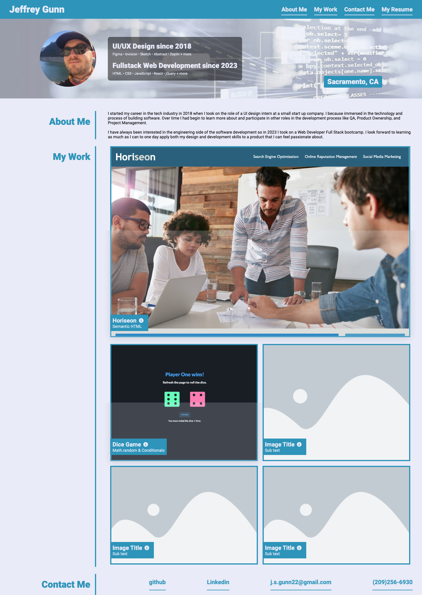
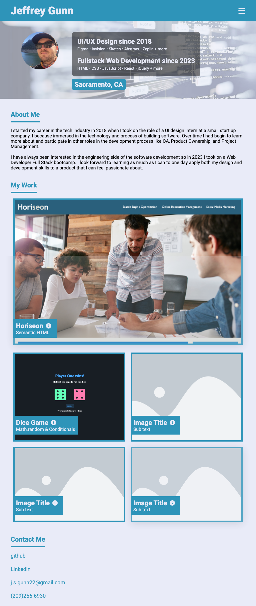
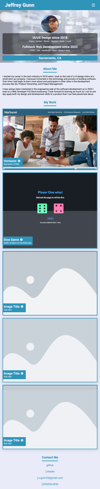

# Challenge 2 - Build a Portfolio: general CSS and HTML exercise

### User Story

AS AN employer
I WANT to view a potential employee's deployed portfolio of work samples
SO THAT I can review samples of their work and assess whether they're a good candidate for an open position

### Acceptance Criteria

GIVEN I need to sample a potential employee's previous work
WHEN I load their portfolio
THEN I am presented with the developer's name, a recent photo or avatar, and links to sections about them, their work, and how to contact them
WHEN I click one of the links in the navigation
THEN the UI scrolls to the corresponding section
WHEN I click on the link to the section about their work
THEN the UI scrolls to a section with titled images of the developer's applications
WHEN I am presented with the developer's first application
THEN that application's image should be larger in size than the others
WHEN I click on the images of the applications
THEN I am taken to that deployed application
WHEN I resize the page or view the site on various screens and devices
THEN I am presented with a responsive layout that adapts to my viewport

## Purpose

The purpose of this challenge is to practice what we have learned with HTML and CSS building a page from the ground up. Notably responsive layouts and clickable links.

## What I learned

I spent a lot of time learning new css properties. I would consider "What do I want this element to do?" then search the web for a solution.

I'm unsure if I did it right but the media queries really add a lot of code. It's wild to see that my css fill is 500+/- lines long.

## My experience with this challenge

A lot of the styles are pretty familiar to me. There were a few times I would be stumped but I would move on and return to the issue later on.

CSS variables make a huge difference.

Handling media queries was a lot of fun.

## Considerations

I think my css file could be a little tidier and easier to navigate. I played around with css nesting but was getting some bugs on the screen. I will try to apply this more in the future but for now what I have works.

If I end up having more time I do what I can to refactor some code to make it more efficient.

## Assets

The live page can be viewed here >> https://jsgunn22.github.io/my-profile/

The following are examples of the portfolio page at different view port sizes

### 1440px

### 768px

### 640px

